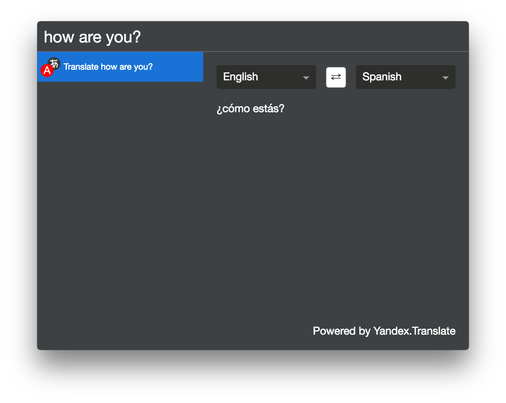

# сerebro-yandex-translate

> Tranlsation plugin for Cerebro that uses yandex.translate API

## Usage
Just type any text, focus on `translate` result and translate to any language.

## Features

* Plugin tries to guess source language;
* Plugin tries to guess target language based on your system language and language of source;
* You can specify target language in query, like `how are you in spanish`, `как дела по английски`

## Related

* [Cerebro](http://github.com/KELiON/cerebro) – Plugin extracted from core Cerebro app;
* [cerebro-plugin](http://github.com/KELiON/cerebro-plugin) – boilerplate to create Cerebro plugins;

## License

MIT © [Alexandr Subbotin](http://asubbotin.ru)
